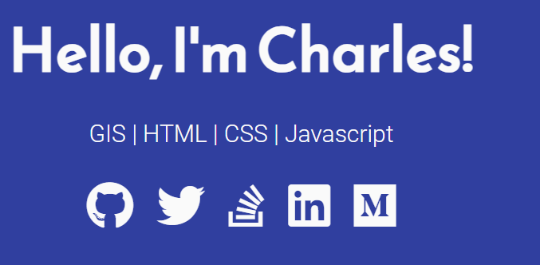

Got it! Here's the complete `README.md` file with proper formatting and the grid structure for the images.

### README.md

```markdown
# Charles Churu | Dev Portfolio

This is a simple yet elegant portfolio webpage for showcasing my skills in GIS, HTML, CSS, and JavaScript. The page uses FontAwesome for social media icons and Google Fonts for stylish typography.



## Features

- **Responsive Design**: The portfolio is fully responsive and works on all devices.
- **Multiple Themes**: Choose from a variety of color themes to personalize the look and feel.
- **Social Media Links**: Quick access to my social media profiles through FontAwesome icons.

## Themes

The portfolio comes with several pre-defined themes. You can switch between these themes by uncommenting the corresponding `<link>` tag in the HTML file.

### Theme Previews

Below are the previews of the available themes. The images are displayed in a grid-like structure for better visualization.

<div style="display: grid; grid-template-columns: repeat(auto-fit, minmax(200px, 1fr)); gap: 20px;">
  <div>
    
    <p>Indigo-White</p>
  </div>
  <div>
    
    <p>Green-White</p>
  </div>
  <div>
    
    <p>Red-White</p>
  </div>
  <div>
    
    <p>Grey-White</p>
  </div>
  <div>
    
    <p>White-Indigo</p>
  </div>
  <div>
    
    <p>White-Blue</p>
  </div>
  <div>
    
    <p>White-Grey</p>
  </div>
  <div>
    
    <p>White-Red</p>
  </div>
  <div>
    
    <p>Yellow-Black</p>
  </div>
</div>

## Getting Started

### Prerequisites

- A modern web browser
- Basic knowledge of HTML and CSS

### Installation

1. Clone the repository:

   ```sh
   git clone https://github.com/yourusername/awesome-dev-portfolio.git
   cd awesome-dev-portfolio
   ```

2. Open `index.html` in your favorite web browser to view the portfolio.

## Usage

1. To change the theme, open `index.html` and uncomment the desired theme's `<link>` tag in the `<head>` section.

2. Customize the content in the `index.html` file to reflect your personal information and projects.

## Contributing

1. Fork the repository.
2. Create a new branch: `git checkout -b my-feature-branch`.
3. Make your changes and commit them: `git commit -m 'Add some feature'`.
4. Push to the branch: `git push origin my-feature-branch`.
5. Submit a pull request.

## License

This project is licensed under the MIT License - see the [LICENSE](LICENSE) file for details.
```

This `README.md` file now includes a well-structured layout with a grid for the theme previews, ensuring the images are displayed neatly.