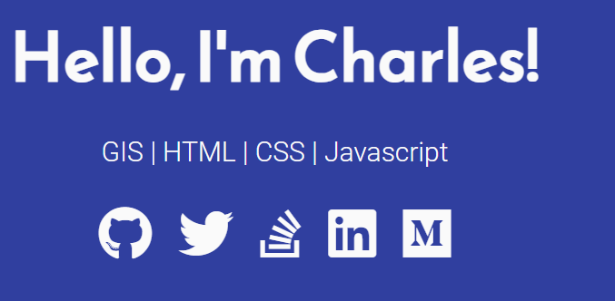
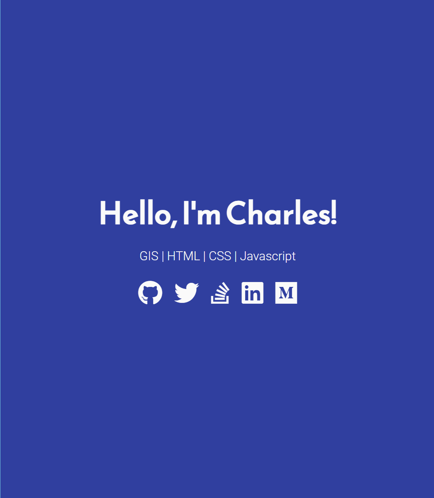
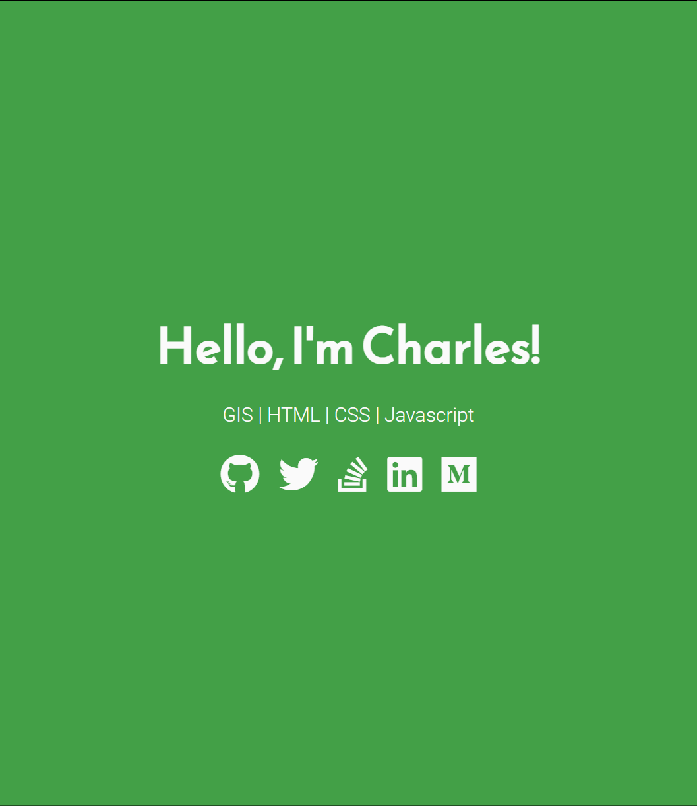
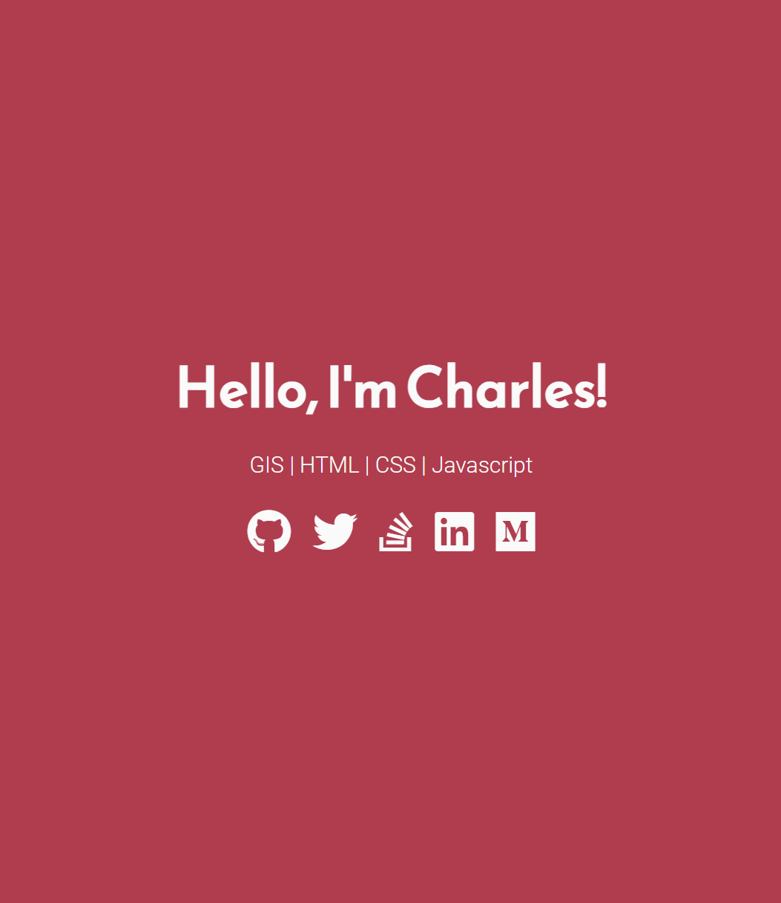
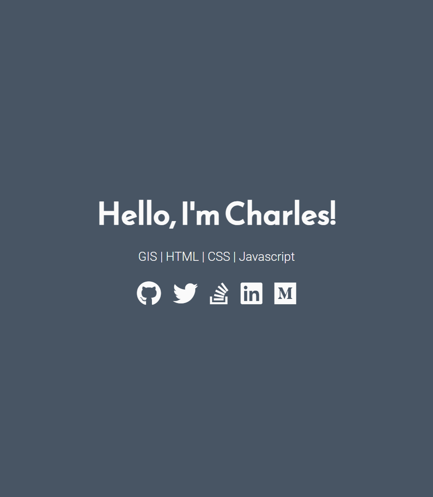
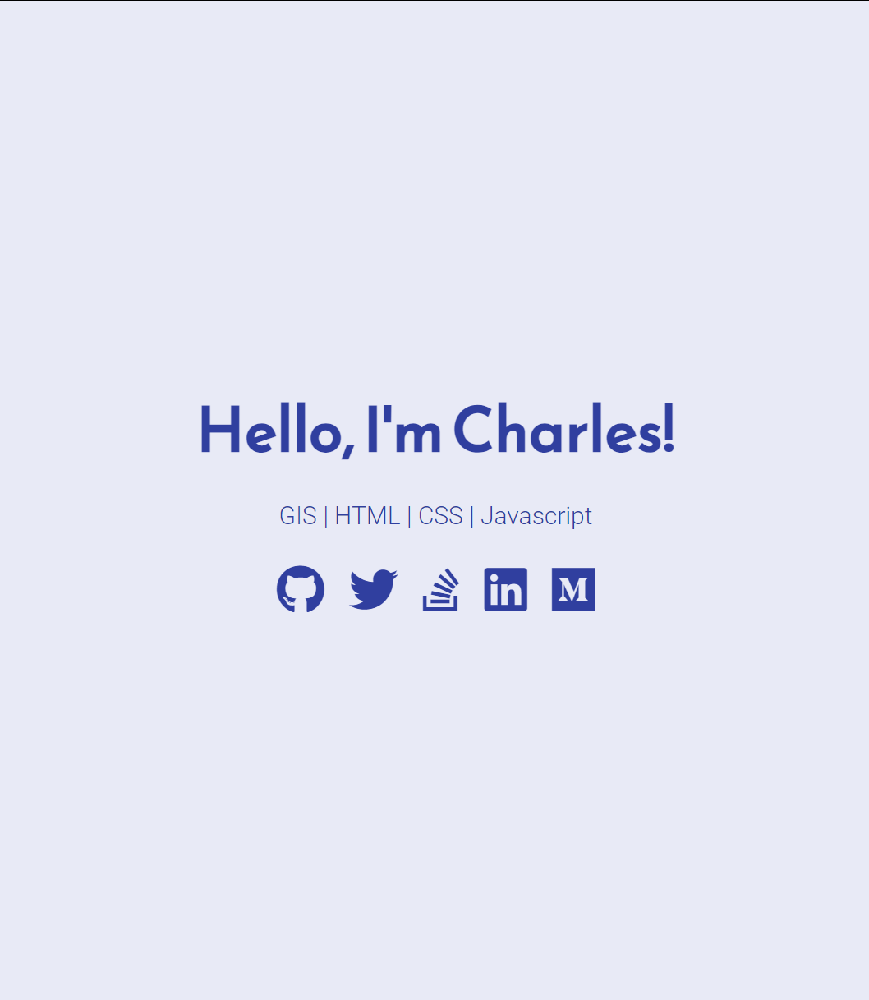
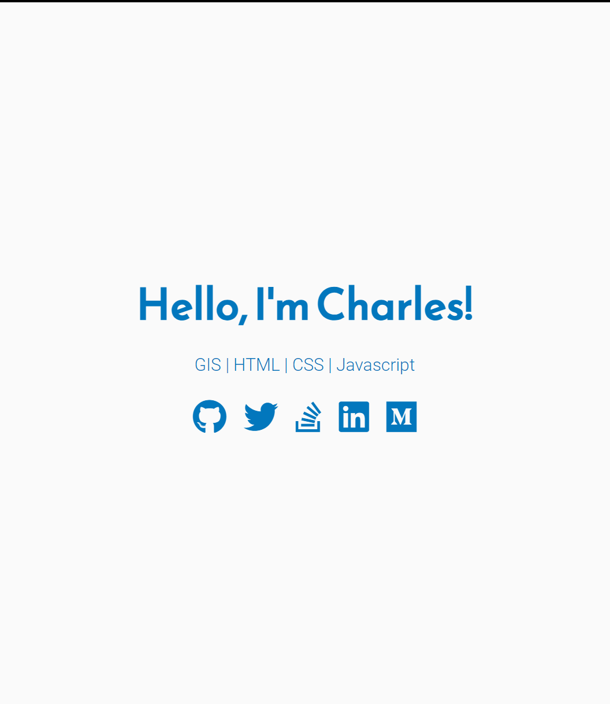
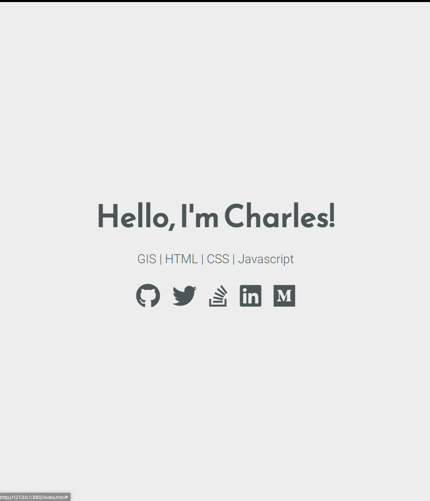
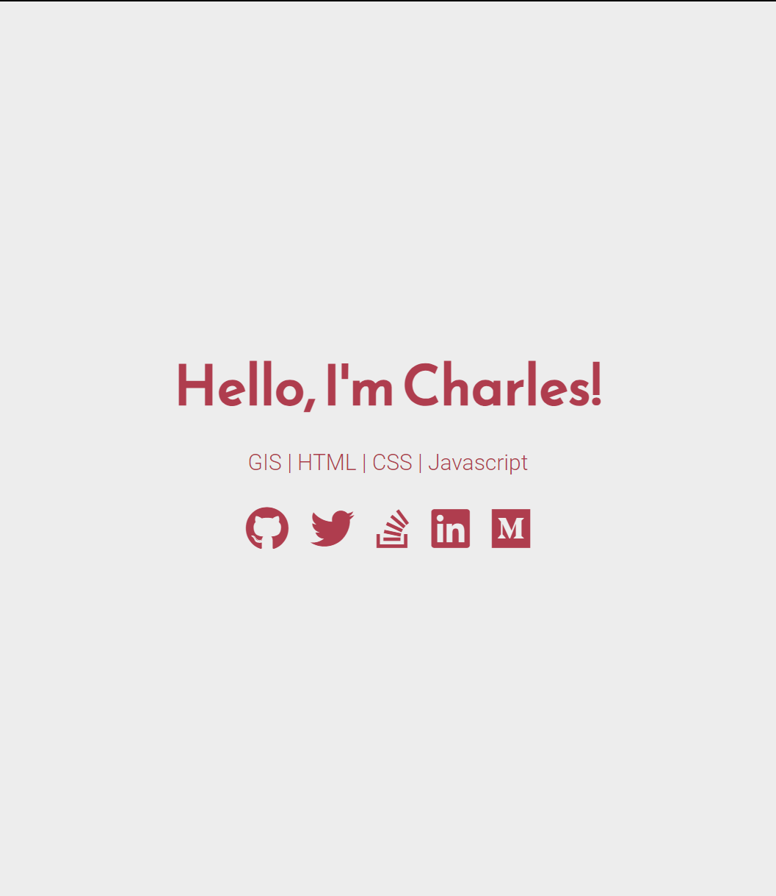
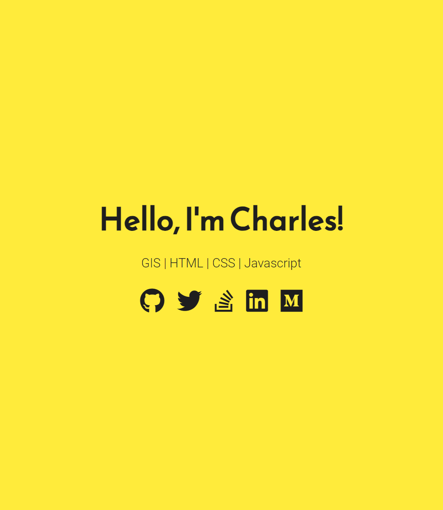

# Charles Churu | Dev Portfolio

This is a simple yet elegant portfolio webpage for showcasing my skills in GIS, HTML, CSS, and JavaScript. The page uses FontAwesome for social media icons and Google Fonts for stylish typography.



## Features

- **Responsive Design**: The portfolio is fully responsive and works on all devices.
- **Multiple Themes**: Choose from a variety of color themes to personalize the look and feel.
- **Social Media Links**: Quick access to my social media profiles through FontAwesome icons.

## Themes

The portfolio comes with several pre-defined themes. You can switch between these themes by uncommenting the corresponding `<link>` tag in the HTML file.

### Indigo-White



### Green-White



### Red-White



### Grey-White



### White-Indigo



### White-Blue



### White-Grey



### White-Red



### Yellow-Black



## Getting Started

### Prerequisites

- A modern web browser
- Basic knowledge of HTML and CSS

### Installation

1. Clone the repository:

   ```sh
   git clone https://github.com/yourusername/awesome-dev-portfolio.git
   cd awesome-dev-portfolio
   ```

2. Open the `index.html` file in your preferred browser to view the portfolio.

3. To switch themes, open the `index.html` file in a code editor, and uncomment the desired `<link>` tag corresponding to the theme you want to use.

### Customization

- **Fonts**: You can change the fonts by updating the Google Fonts link in the `<head>` section of the `index.html` file.
- **Icons**: Add or remove social media icons by modifying the `<i>` tags with the appropriate FontAwesome classes.
- **Content**: Update the content of the webpage by editing the HTML structure in `index.html`.

## Contributing

If you would like to contribute to this project, please fork the repository and create a pull request with your changes. Contributions are always welcome!

## License

This project is licensed under the MIT License - see the [LICENSE](LICENSE) file for details.

---

Feel free to reach out via my social media links provided in the portfolio!

```
